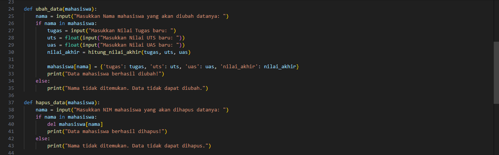

LANGKAH-LANGKAH LATIHAN
1. Mengimport lambang yang akan digunakan
2. Masukkan contoh penggunaan dari setiap lambang yang sudah dibuat
3. Print data yang sudah di buat
4. Lalu run file agar hasilnya terlihat
# LATIHAN 

LANGKAH-LANGKAH PRAKTIKUM 
1. Memasukan nilai-nilai akhir seperti tugas, UTS, dan UAS.
2. Menampilkan data yang berisi (Nama, Nilai Tugas, Nilai UTS, dan Nilai UAS).
3. Mengubah data dengan cara memasukan Nama kembali.
4. Jika ingin menghapus data maka masukan Nama yang akan di hapus.
5. Mencari data, dengan cara memasukan Nama yang akan di cari.
6. Else Blok kode dibawah else akan dijalankan jika semua kondisi dalam if dan elif sebelumnya bernilai False.
# PRAKTIKUM 

# Menambahkan Data

# Menampilkan Data

# Flowchart

